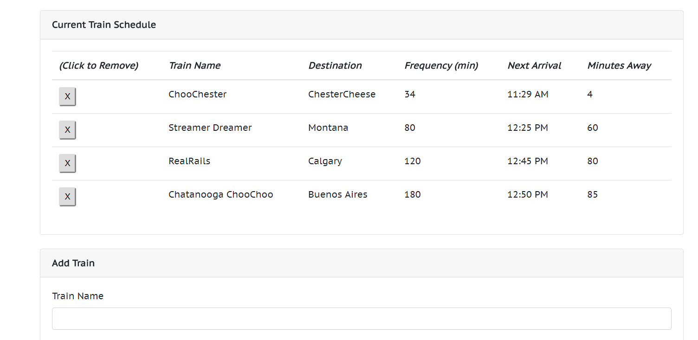

# Train-Scheduler

## Coding Bootcamp Project

This browser based application uses JavaScript and the Firebase database to show a current train schedule. Users can input a new train, including its name, destination, first departure, and frequency. JavaScript code, including the moment.js library, will display and the name, destination, frequency, next arrival time, and how many minutes until the next departure. Trains can also be deleted. The schedule is updated dynamically in real time using the Firebase database.

Screenshot:

